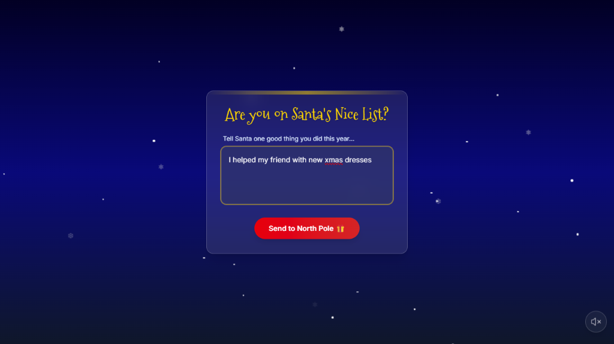
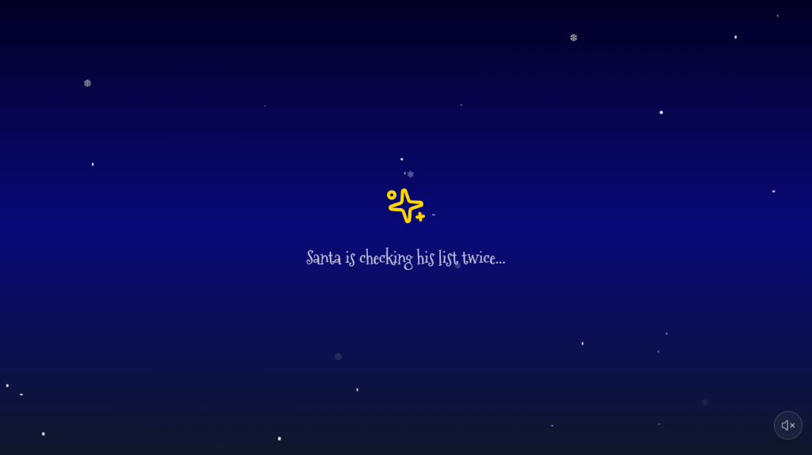
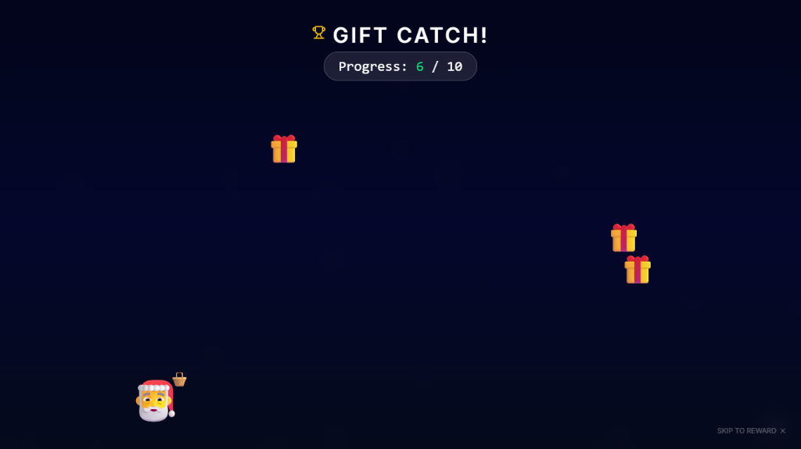

# 🎅 Santa-App: A Magical North Pole Experience

A beautifully crafted React application that celebrates the spirit of giving. Users share their "Good Deeds," and through a cinematic sequence of animations and music, they receive a personalized gift card from Santa himself.


## ✨ The Experience

- **Cinematic Atmosphere:** Deep midnight sky with CSS-animated shimmering stars.
- **Smart Audio:** Interactive background music that bypasses browser autoplay restrictions.
- **The "Nice List" Logic:** A glassmorphic form that captures user kindness.
- **The Grand Reveal:** A multi-stage animation sequence featuring confetti cannons and festive sound effects.
- **Personalized Souvenir:** A dynamically generated gift card with the user's deed written on Santa’s gift tag.

## 🛠️ Tech Stack

- **Frontend:** React.js (Vite)
- **Styling:** Tailwind CSS (Glassmorphism & Gradients)
- **Animations:** Framer Motion & Canvas-Confetti
- **Icons:** Lucide-React
- **Image Processing:** html2canvas (for gift card downloads)

## 🚀 Installation & Setup

1. Clone the repository:
   ```bash
   git clone https://github.com/your-username/Santa-App.git
   ```

2. Install dependencies:
   ```bash
   npm install
   ```

3. Run the development server:
   ```bash
   npm run dev
   ```

4. Open your browser and navigate to the local URL (usually `http://localhost:5173`).

## 📸 Screenshots


*Tell Santa your good deed...*


*Santa checks his list...*


*Help Santa load the sleigh!*


*Your personalized North Pole Certification!*
